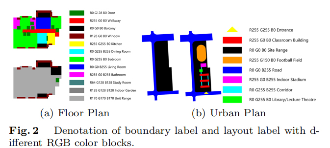
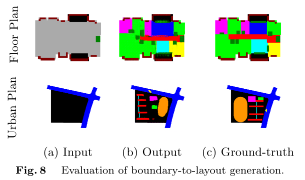
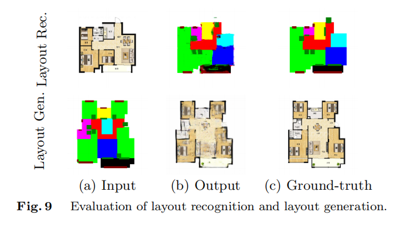
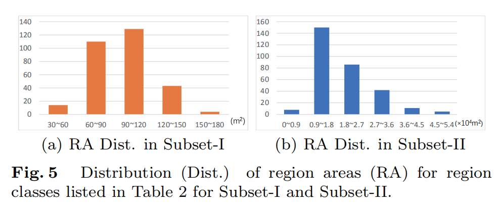
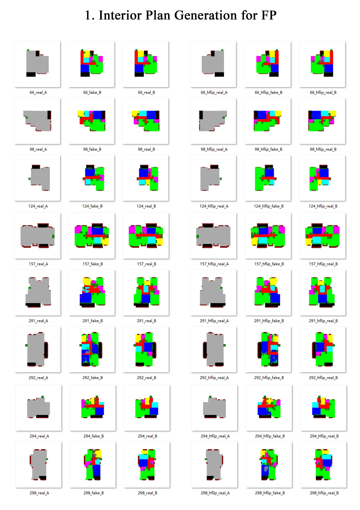
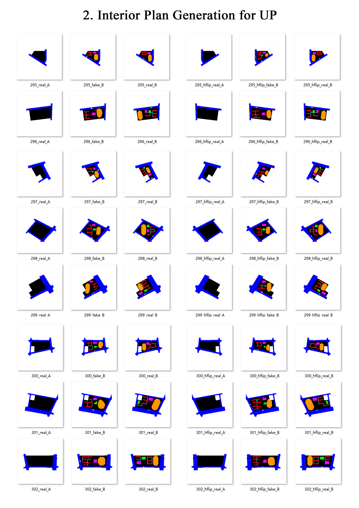
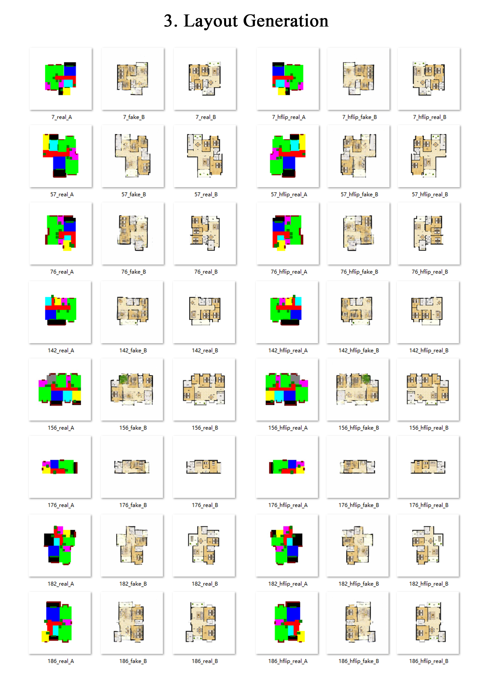
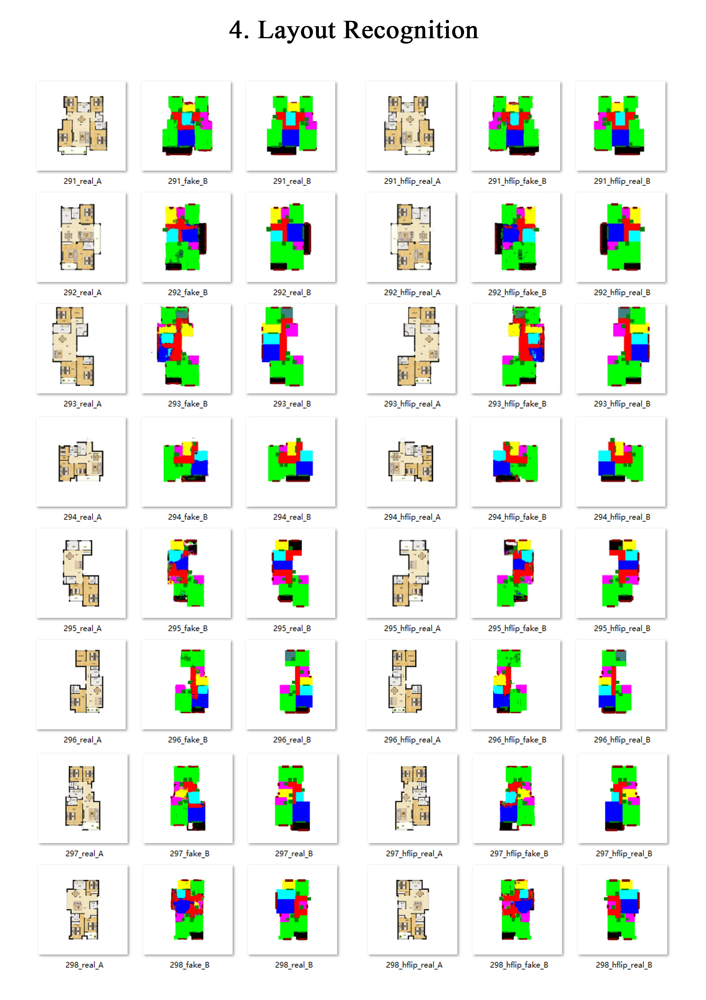

SCUT-AutoALP-Database-Release
===
We provide a diverse benchmark database (Size =583MB) for floor plan/urban plan layout generation and parsing tasks. The database is available at: 

* https://pan.baidu.com/s/14LWNqeri6t9a_IUEoavS6Q (code: 3uq4)

* https://drive.google.com/open?id=1u8bM3wsMRbDItnlr_-VKZmUbb-9Umevv

1 Description
---
The SCUT-AutoALP database contains 300 residential floor plan samples and 302 school urban plan samples with corresponding dense labels. The database can be used for different architectural layout generation and parsing tasks, such as interior plan generation and layout recognition, etc.

2 Database Construction
--
The SCUT-AutoALP Dataset contains totally 602 samples with dense labels annotated by architectural professionals, which can be divided into two subsets.

Subset-I is composed of 300 residential floor plan image samples. The original samples were collected from [Lianjia](https://www.lianjia.com), and filtered by architecture professionals. The filtered samples were scaled to 1: 100 and placed on 20cm×20cm pure white background images. For layout parsing, we use different RGB color blocks to denote different regions for boundary labels and layout labels, as shown in Fig. 2a. Each sample is labelled with the corresponding architecture area indexes.

Subset-II is composed of 302 urban plan image samples of primary school campus. The original samples were collected from internet, like websites of architectural design or government. All the cleaned samples were scale to 1: 1800, and placed on 24cm×24cm white background images. For layout parsing, we use different RGB color blocks to denote different regions for boundary labels and layout labels, as shown in Fig. 2b.  Each sample is labeled with architecture indexes like building area, building density and floor area ratio attribute, etc.

3 Applications
--
With different combination of samples and labels, SCUT-AutoALP is available for different applications related to  architecture layout. For example, boundary label and layout label allow interior plan generation; 

and samples and layout labels allow image-to-image layout recognition.

4 Dataset Statistics
--

We conduct statistics with the samples in the dataset. The results are shown in following figure: 

For more details please refer to our paper.

5 Layout Parsing of SCUT-AutoALP
--
We evaluated SCUT-AutoALP for different layout parsing tasks, including interior plan generation and layout recognition/generation. 

The above two figures show the results of interior plan generation for floor/urban plan, which takes layout label as output ground-truth, boundary label as input condition.

The above two figures show the results of layout generation/recognition for floor plan, which takes layout label/sample as output ground-truth, sample/layout label as input condition.

All the results (Size = 3.46MB) is available at: 

* https://pan.baidu.com/s/1Ww54e12uGnNocA35Wl2-GQ (code: nmwc)

* https://drive.google.com/open?id=1CiObapGiDtBZyEQR-HMP-d0Ts0AN1UQI

6 Project Contributer and Contact
--
The dataset is the initial achievement of interdisciplinary cooperation between the School of Architecture and the School of Electronics and Information Engineering of South China University of Technology (SCUT). 

The whole project is supervised by:
* Professor Yubo Liu (liuyubo@scut.edu.cn)
* Associate Professor Qiaoming Deng (dengqm@scut.edu.cn)
* Associate Professor Lingyu Liang (lianglysky@gmail.com)

Among the team, Yangting Lai led the design and creation of the dataset, Jianyong Chen provided technical support for algorithms and data collection, and Wenqiang Lin provided significant contribution to the creation of the dataset.
For more detailed informations, please contact:

* Yangting Lai (laiyangtinglynne@qq.com)
* Jianyong Chen (theochan666@gmail.com)
* Wenqiang Lin (857813742@qq.com)

For any questions about this database please contact the authors by sending email to designfuturelab702@scut.edu.cn and lianglysky@gmail.com.

Desclaimer
--

The dataset is for academic research use only. We are not responsible for the objectivity and accuracy of the proposed dataset.
